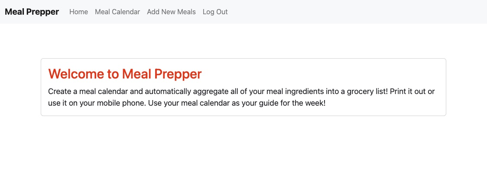
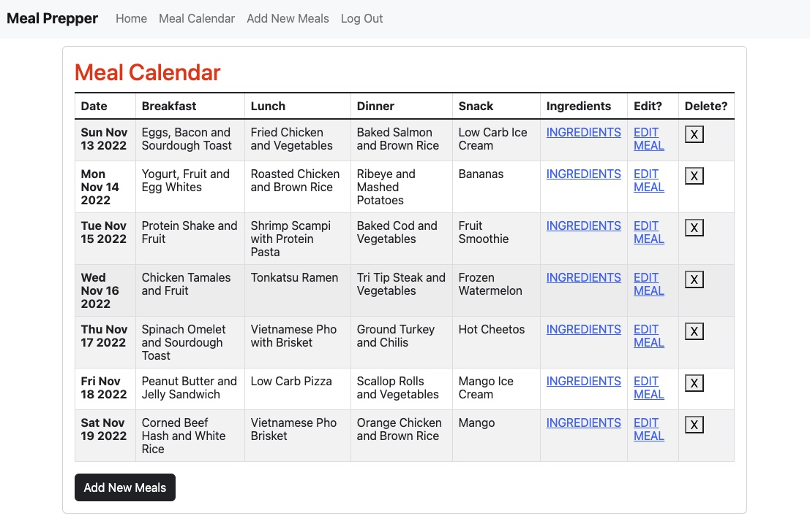
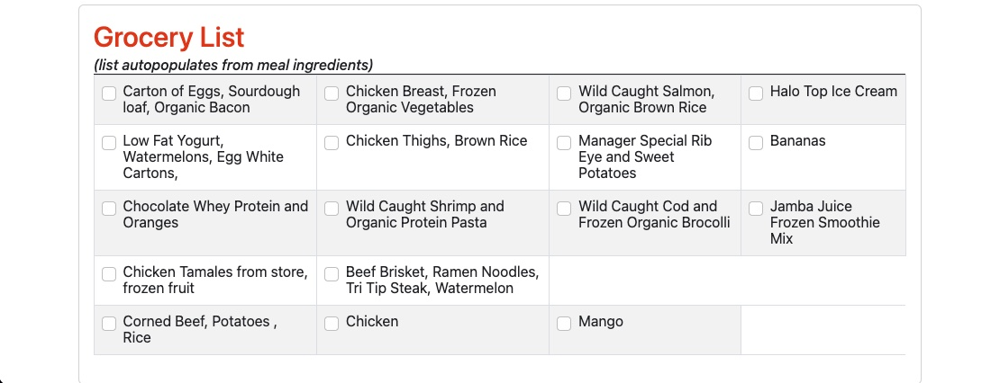
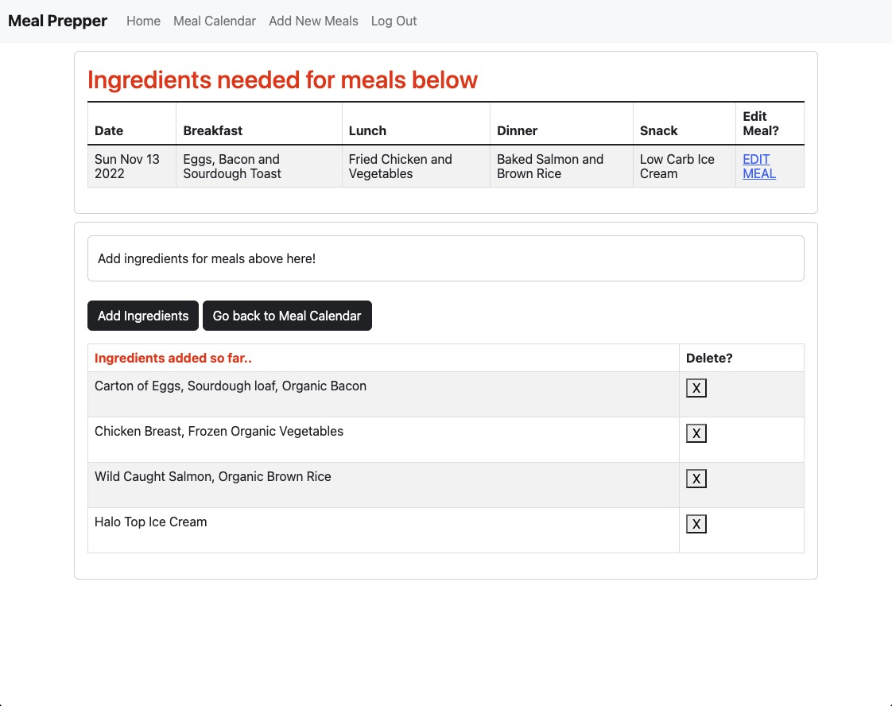
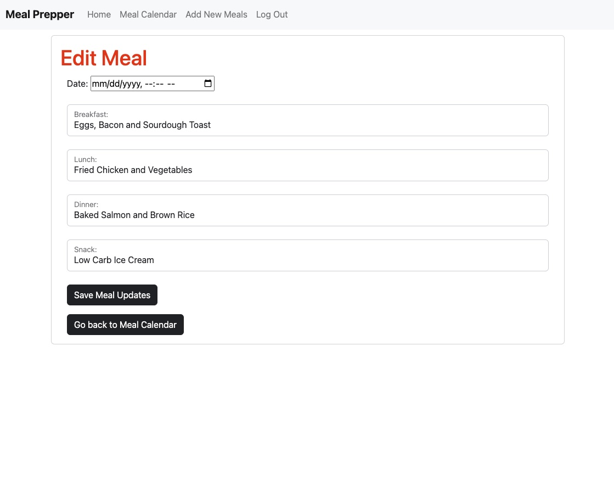

 # **Meal Prepper**
 
 ### ***Create a meal calendar and automatically aggregate all of your meal ingredients into a grocery list! Print it out or use it on your mobile phone. Use your meal calendar as your guide for the week!***
&nbsp;
## **Wireframes:**

&nbsp;

## **Screenshots:**

&nbsp;

## **ERD Diagram:**

&nbsp;

 

## **Trello Board:**

**https://trello.com/b/xctPWADV/meal-prepper-project-board** 

## **Technologies Used:**
- HTML
- CSS
- Javascript
- MongoDB
- Express.JS
- Mongoose
- Bootstrap

&nbsp;
## **Next Steps:**
&nbsp;
Future Enhancements will include: 
- Calorie Tracker
- Macro Views (Protein, Fat, Carbs)
- Add Random Recipe API in Add New Meals section

