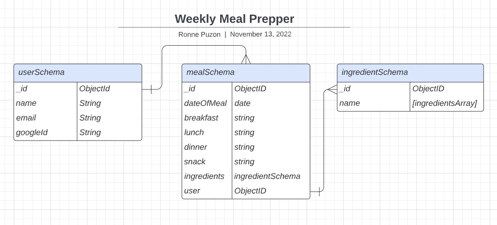

 # **Meal Prepper**
 
 ### ***Meal Prepper will allow you to plan and track your weekly meals and manage a grocery list***
&nbsp;
## **Wireframes:**

&nbsp;

## **ERD Diagram:**

&nbsp;

 

## **Trello Board:**

**https://trello.com/b/xctPWADV/meal-prepper-project-board** 

## **Technologies Used:**
- HTML
- CSS
- Javascript
- MongoDB
- Express.JS
- Mongoose.JS

&nbsp;
Add link here
&nbsp;
## **Next Steps:**
&nbsp;
Future Enhancements will include: 
- Calorie Tracker
- Macro Views (Protein, Fat, Carbs)

